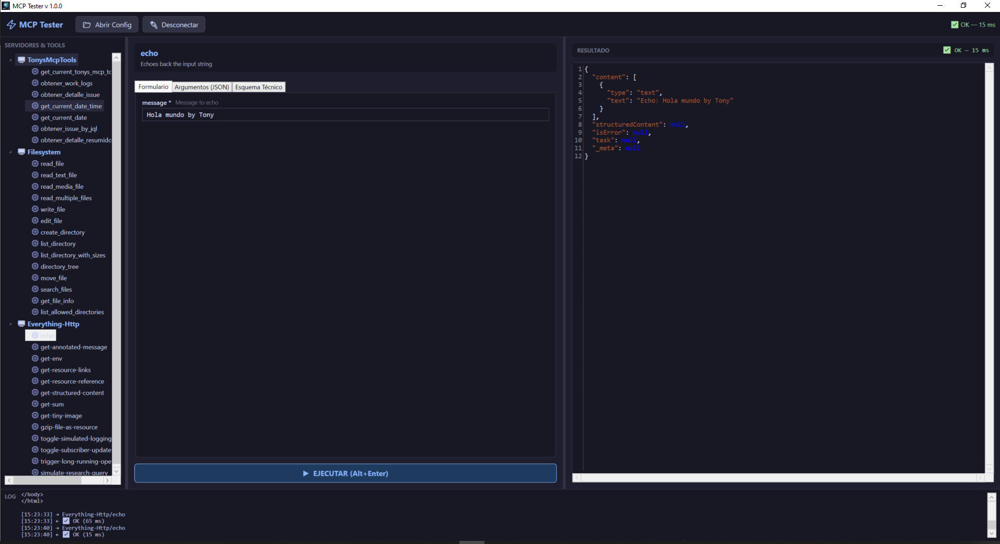
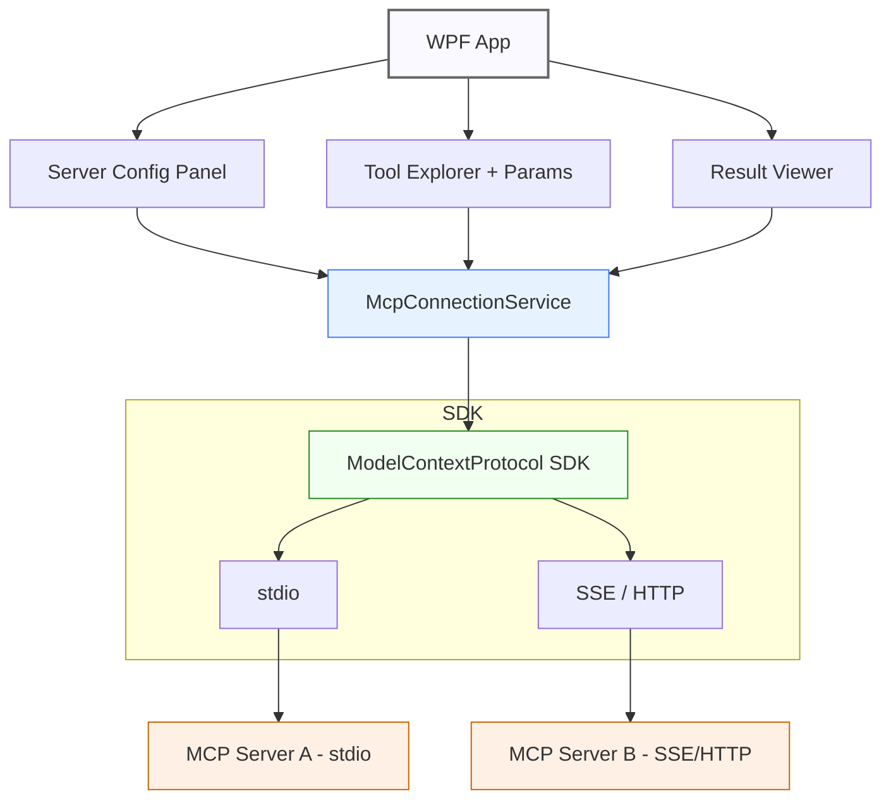

# McpTester

**McpTester** es una aplicación de escritorio WPF (.NET 10) diseñada para probar e inspeccionar servidores [Model Context Protocol (MCP)](https://modelcontextprotocol.io) de forma visual e interactiva, sin necesidad de modificar código.



---

## ✨ Características

- 🔌 **Multi-transporte**: soporta `stdio`, `SSE` y `streamableHttp`
- 🌳 **Explorador de herramientas**: lista todas las tools disponibles de cada servidor MCP conectado
- ⚡ **Formulario dinámico**: genera controles UI automáticamente a partir del `inputSchema` de cada tool
- ✏️ **Editor JSON raw**: alternativa al formulario con edición directa de parámetros (con syntax highlighting via AvalonEdit)
- 📊 **Visor de resultados**: muestra la respuesta formateada en JSON con indicador de tiempo de ejecución
- ⚙️ **Config externa**: lee servidores desde `mcp-servers.json` (compatible con el formato Claude Desktop)

---

## 🏗️ Arquitectura

```
┌─────────────────────────────────────────────────┐
│                    WPF App                       │
│                                                  │
│  ┌─────────────┐  ┌─────────────┐  ┌──────────┐ │
│  │  Server      │  │  Tool       │  │ Result   │ │
│  │  Config      │  │  Explorer   │  │ Viewer   │ │
│  │  Panel       │  │  + Params   │  │          │ │
│  └──────┬───────┘  └──────┬──────┘  └────┬─────┘ │
│         │                 │              │        │
│  ┌──────▼─────────────────▼──────────────▼──────┐ │
│  │            McpConnectionService              │ │
│  │  (gestiona N conexiones a MCP servers)        │ │
│  └──────────────────┬───────────────────────────┘ │
│                     │                              │
│  ┌──────────────────▼───────────────────────────┐ │
│  │         ModelContextProtocol SDK             │ │
│  │    ┌──────────┐      ┌───────────────┐       │ │
│  │    │  stdio   │      │ SSE / HTTP    │       │ │
│  │    └──────────┘      └───────────────┘       │ │
│  └──────────────────────────────────────────────┘ │
└─────────────────────────────────────────────────┘
         │                        │
    ┌────▼─────┐            ┌─────▼──────┐
    │ MCP      │            │ MCP        │
    │ Server A │            │ Server B   │
    │ (stdio)  │            │ (SSE/HTTP) │
    └──────────┘            └────────────┘
```



---

## 🛠️ Stack tecnológico

| Paquete | Versión | Propósito |
|---|---|---|
| `ModelContextProtocol` | 1.0.0 | SDK oficial C# MCP (Microsoft) |
| `ModelContextProtocol.AspNetCore` | 1.0.0 | Soporte transporte HTTP/SSE |
| `CommunityToolkit.Mvvm` | 8.4.0 | MVVM con source generators |
| `AvalonEdit` | 6.3.1 | Editor de JSON con syntax highlighting |
| `Microsoft.Extensions.Logging.Abstractions` | 10.0.3 | Logging |

**Framework:** `.NET 10.0-windows` · **UI:** WPF (XAML + MVVM)

---

## ⚙️ Configuración de servidores (`mcp-servers.json`)

La aplicación lee la configuración de servidores MCP desde el archivo `McpTester/mcp-servers.json`:

```json
{
  "servers": {
    "MiServerStdio": {
      "transport": "stdio",
      "command": "npx",
      "args": ["-y", "@modelcontextprotocol/server-filesystem", "C:/ruta"],
      "env": { "DEBUG": "true" }
    },
    "MiServerSSE": {
      "transport": "sse",
      "url": "http://localhost:3001/sse"
    },
    "MiServerHttp": {
      "transport": "streamableHttp",
      "url": "http://localhost:3001/mcp"
    }
  }
}
```

> **Nota:** El formato es compatible con el archivo de configuración de Claude Desktop.

---

## 🚀 Cómo ejecutar

### Requisitos previos

- [.NET 10 SDK](https://dotnet.microsoft.com/download/dotnet/10.0)
- Windows 10/11

### Compilar y ejecutar

```powershell
# Clonar el repositorio
git clone <url-del-repo>

# Compilar
dotnet build

# Ejecutar
dotnet run --project McpTester\McpTester.csproj
```

---

## 📁 Estructura del proyecto

```
McpTester/
├── Models/             # Modelos de datos (ServerConfig, etc.)
├── Services/           # McpConnectionService
├── ViewModels/         # MainViewModel (MVVM)
├── Converters/         # Value converters WPF
├── MainWindow.xaml     # UI principal (3 paneles)
├── mcp-servers.json    # Configuración de servidores MCP
└── McpTester.csproj
Docs/
└── images/             # Capturas de pantalla
ResumenArquitectonico.md  # Documentación técnica detallada
```

---

## 📋 Flujo de uso

1. Editar `mcp-servers.json` con los servidores MCP a probar
2. Iniciar la aplicación
3. Seleccionar un servidor y conectarse
4. Explorar las tools disponibles en el árbol lateral
5. Seleccionar una tool, completar sus parámetros y ejecutar
6. Ver el resultado JSON con el tiempo de respuesta

---

## 📄 Licencia

Distribuido bajo los términos de la licencia incluida en el archivo [`LICENSE`](LICENSE).
